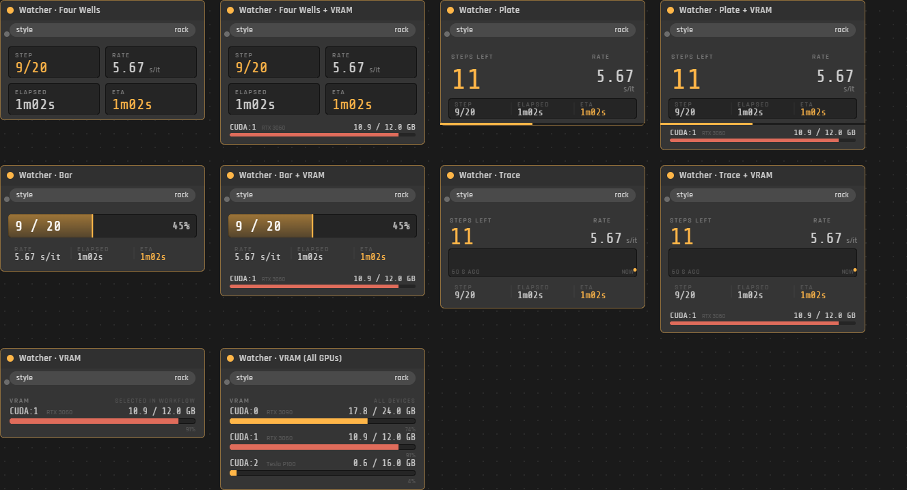
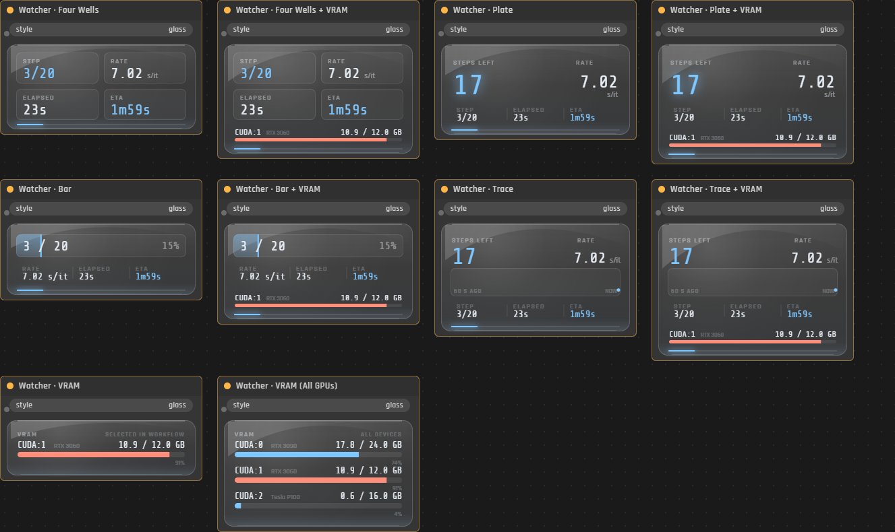
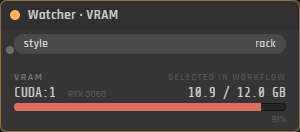

# Watcher Nodes for ComfyUI

Nodes that sit on your canvas and tell you how the current run is going: what step it's on, how
fast it's going, how long it's been running, and when it'll be done. Plus VRAM, if you want it.

I built these because I kept scrolling around looking for the progress bar on the node that was
running, and because the number I actually care about is "how much longer", which ComfyUI doesn't
tell you anywhere. Now it's parked in the corner of my graph where I can see it.



Same nodes, glass style:



## What you get

Ten nodes, under **Add Node → comfyuiWATCHER**:

- **Four Wells** — step, rate, elapsed, ETA in four boxes.
- **Plate** — big steps-remaining number, everything else smaller underneath.
- **Bar** — the node is basically one big progress bar. Shortest of the lot.
- **Trace** — same numbers plus the last 60 seconds of speed as a little graph, so you can see it
  slowing down or speeding up.
- Each of those four again as **+ VRAM**, which adds a VRAM row at the bottom.
- **VRAM** on its own, if that's all you want — just the card(s) this workflow uses.
- **VRAM (All GPUs)** — every card in the box, whatever the workflow is doing. Handy when
  something else is hogging a GPU.

All four job layouts also carry a **NODE** line: which node of the run is going right now, and how
far through the graph that is — `4/21 KSampler`. The step count only tells you how far into one
node you are, and a graph spends most of its time loading, encoding and decoding either side of the
sampler. If nothing has run yet it shows a dash; if the workflow size isn't known it shows the
position on its own rather than inventing a total.

Every node has a **style** dropdown on it: `rack` or `glass`. It's a widget, not a separate node,
so you can flip it without deleting anything and it saves with your workflow.

They don't do anything to your graph. No inputs, no outputs, they never execute. Drop one anywhere.

## Install

Clone it into your ComfyUI `custom_nodes` folder:

```
cd ComfyUI/custom_nodes
git clone https://github.com/an80sPWNstar/comfyui-watcher-nodes
```

Windows portable: `ComfyUI_windows_portable\ComfyUI\custom_nodes\`
Desktop app: whatever base folder you picked at setup, then `ComfyUI\custom_nodes\`
Linux: `~/ComfyUI/custom_nodes/`

Then **restart ComfyUI** — not just a browser refresh, it's a Python folder. In the log you
should see:

```
comfyuiWATCHER progress relay installed (broadcasting watcher.* events)
```

Right click the canvas → **Add Node → comfyuiWATCHER** → pick one.

No pip installs, no requirements.txt, nothing to build. It's plain Python and plain JS.

### If you'd rather not use git

Green **Code** button → **Download ZIP**, unzip, and put the folder in `custom_nodes`. You want
to end up with:

```
ComfyUI/custom_nodes/comfyui-watcher-nodes/
    __init__.py
    README.md
    web/
```

If the nodes don't show up, it's almost always that the folder is nested one level too deep —
`custom_nodes/comfyui-watcher-nodes-main/comfyui-watcher-nodes/` is the usual one after unzipping.
The `__init__.py` has to be directly inside the folder that sits in `custom_nodes`.

### Upgrading from an earlier copy

These nodes used to ship inside the [comfyuiWATCHER desktop
app](https://github.com/an80sPWNstar/ComfyUIWatcher) as a folder called `comfyui-watcher-relay`.
If you have that one, **delete it** before installing this — two copies register the nodes twice
and patch the progress relay twice.

## The VRAM node only shows the GPU you're actually using



If you've got more than one card, ComfyUI knows about all of them, but your workflow is probably
only using one. So:

- If a node in your graph picks a device, you get those cards and nothing else. It reads both
  kinds: ComfyUI's own **Select Model / CLIP / VAE Device** nodes (`gpu:0`, `gpu:1`) and the
  [ComfyUI-MultiGPU](https://github.com/pollockjj/ComfyUI-MultiGPU) pack's (`cuda:0`, `cuda:1`).
- **MultiGPU CFG Split** is handled too, which is a bit different: that node doesn't name a card,
  it takes a count. So `max_gpus 2` means it'll use your main card plus the next one, and that's
  what you get — two rows.
- Bypassed and muted nodes don't count, since they're not going to run. Neither does `default`,
  which just means "wherever ComfyUI was going to put it anyway".
- If nothing picks one, you get the card ComfyUI itself is running on. One row.

If you'd rather just see everything, use **Watcher · VRAM (All GPUs)**, which ignores all of that
and lists every card ComfyUI can see.

The node tells you which of those it did — `SELECTED IN WORKFLOW`, `COMFYUI DEVICE` or
`ALL DEVICES` — because one row means something different in each case.

The number is the card's actual usage, not just ComfyUI's, so anything else on that GPU counts too.
That's on purpose — that's the number that decides whether your next run OOMs.

**It's the same number `nvidia-smi` and `nvitop` show you.** That took some doing: ComfyUI's own
`/system_stats` counts PyTorch's idle allocator cache as *free*, which is fair enough from its point
of view but reads about 6 GB low next to every other tool on the box. So the VRAM rows are read from
NVML, the same place nvitop reads. On a card where NVML isn't available (AMD, or no `pynvml`) it
falls back to ComfyUI's figures with the cache added back in, which is close but a little high.

AMD works. ComfyUI reports the same stuff on ROCm, and PyTorch calls AMD cards `cuda:0` there too,
so it all lines up. The node prints `ROCm` next to the header so you know it noticed. I don't have
an AMD card to test on, so if it looks wrong on yours, tell me.

## About step counts from the ComfyUI UI vs. other clients

Worth knowing, since it's the one confusing bit.

ComfyUI only sends progress messages to whoever submitted the job. If you queue from the ComfyUI
tab you're looking at, that's you, and everything works with no extra setup.

If something *else* queued the job — a second browser tab, an API script, a phone, my
[comfyuiWATCHER](https://github.com/an80sPWNstar/ComfyUIWatcher) desktop widget — then that tab
never gets the progress messages, and the node would sit there with nothing to show.

So this folder also patches ComfyUI to re-broadcast those messages under a different name that its
own UI ignores. That's the "progress relay installed" line in the log. It means the nodes work for
jobs from anywhere, not just from the tab they're sitting in.

Every patch is wrapped in a try/except that falls back to doing nothing. If a future ComfyUI
version changes something underneath it, you lose the extra progress info and nothing else — your
runs are untouched.

## What it won't make up

When it doesn't know something, it says so instead of printing a zero:

- No step data yet → `N/A`, not `0`.
- No ETA until it has actually measured a speed. It won't guess one off a single step.
- If you open the tab in the middle of a run, elapsed shows `--`, because nobody knows when that
  run started. Counting from when the tab opened would just be a made-up number.

The speed is the average of the recent per-step times with the pauses thrown out (model loads,
checkpoint saves, VAE decode), so it reflects what the sampler is doing now instead of dragging a
lifetime average around. On a batch, the progress bar restarts for every image — it handles that,
and keeps the speed reading across the gap.

## Requirements

- ComfyUI. Tested on 0.33.1 (Windows, CUDA 13, PyTorch 2.13).
- That's it.

## Notes

Fonts (Share Tech Mono, Rajdhani) ship with the folder under `web/fonts/` and are SIL Open Font
License. Nothing here phones home, downloads anything, or touches your models.

If you want the same thing outside the browser — a desktop widget watching several ComfyUI boxes
and ai-toolkit training runs at once — that's
[comfyuiWATCHER](https://github.com/an80sPWNstar/ComfyUIWatcher), which is where these nodes came
from.

Bugs, ideas, "it looks wrong on my setup" — open an issue.
